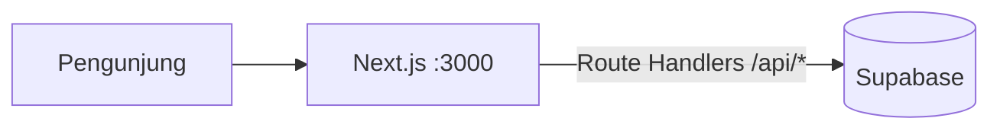

# 📰 KabarNusantara

Portal berita Indonesia (gaya Kompas) yang menekankan **keterbacaan** (readability) dan **estetika** — responsif untuk ponsel maupun desktop. Dibangun dengan **Next.js** (App Router + Route Handlers) dan **Supabase** (PostgreSQL terkelola).

## ✨ Fitur

- 🏠 **Beranda** — hero headline, berita terbaru, terpopuler, dan pilihan kategori
- 📄 **Halaman artikel** — tipografi editorial, drop cap, estimasi waktu baca, tombol bagikan (X, Facebook, WhatsApp, salin tautan), berita terkait
- 🗂️ **Halaman kategori** — daftar berita per kategori dengan pagination
- ✍️ **Tulis Berita** — penerbitan artikel dikunci: wajib masuk sebagai redaksi (`/masuk`); tombol "Tulis Berita" hanya tampil untuk yang sudah login
- 🔍 **Pencarian** — cari judul, ringkasan, dan isi artikel
- 🌗 **Mode gelap/terang** — tersimpan di perangkat, mengikuti preferensi sistem
- 📱 **Responsif penuh** — menu mobile, grid adaptif, hingga layar 320 px
- 🗃️ **Supabase (PostgreSQL)** — 9 kategori, 57+ artikel dwibahasa Indonesia/Inggris (seed otomatis)

## 🏗️ Arsitektur



| Layanan | Teknologi | Port |
| --- | --- | --- |
| `web` | Next.js 16 (App Router, SSR/ISR, Route Handlers) | 3000 |
| `db` | Supabase (PostgreSQL terkelola) | cloud |

> API REST kini menjadi **Route Handlers** bawaan Next.js (`web/src/app/api/`) — tidak ada service terpisah, sehingga cukup satu container untuk web + API.

## 🚀 Menjalankan

```bash
# 1. Salin konfigurasi lingkungan (opsional — ada nilai bawaan)
cp .env.example .env

# 2. Bangun & jalankan seluruh layanan
docker compose up --build

# 3. Buka
#    Web   → http://localhost:3000
#    API   → http://localhost:3000/api/health
#    Login → http://localhost:3000/masuk
```

Container `web` otomatis membuat skema dan mengisi data awal (idempotent) sebelum mulai melayani. **Login redaksi** memakai **Google OAuth** — hanya email yang terdaftar di tabel `authors` yang boleh masuk. Seed mendaftarkan `fathandwipayana@gmail.com` secara otomatis.

### Setup Supabase (database)

1. Buat project gratis di [supabase.com](https://supabase.com).
2. Buka **Project Settings → Database → Connection string**.
3. Salin connection string **Transaction pooler** (port 6543) ke `DATABASE_URL` di `.env`:

```bash
DATABASE_URL=postgresql://postgres.<ref>:<password>@aws-0-<region>.pooler.supabase.com:6543/postgres
```

   SSL otomatis aktif (host `*.supabase.co` / `*.supabase.com`); DSN boleh juga memakai `?sslmode=require`.
4. Skema + seed dijalankan otomatis saat container `web` start (idempotent). Manual:

```bash
docker compose exec web node scripts/seed.mjs
```

### Setup Google OAuth

1. Buka [Google Cloud Console](https://console.cloud.google.com/apis/credentials) → buat **OAuth Client ID** (tipe *Web application*).
2. Tambahkan **Authorized redirect URI**: `http://localhost:3000/api/auth/google/callback` (sesuaikan domain/port saat produksi).
3. Isi kredensial di `.env` (salin dari `.env.example`):

```bash
GOOGLE_CLIENT_ID=<client-id-anda>
GOOGLE_CLIENT_SECRET=<client-secret-anda>
```

4. (Opsional) Daftarkan penulis tambahan — dipisah koma:

```bash
AUTHOR_EMAILS=penulis@contoh.com,kontributor@contoh.com
```

> Tanpa `GOOGLE_CLIENT_ID`/`GOOGLE_CLIENT_SECRET`, tombol masuk di `/masuk` menampilkan pesan "belum dikonfigurasi".

### Perintah berguna

```bash
docker compose up -d          # jalankan di latar belakang
docker compose logs -f web    # lihat log web
docker compose down           # hentikan layanan (data tetap aman di Supabase)
docker compose exec web node scripts/seed.mjs   # seed ulang (idempotent)
```

## 🔌 API

Seluruh endpoint disajikan oleh Next.js Route Handlers pada port yang sama dengan web:

| Method | Endpoint | Deskripsi |
| --- | --- | --- |
| GET | `/api/categories` | Daftar kategori + jumlah artikel |
| GET | `/api/articles/headlines?limit=5` | Artikel unggulan (hero) |
| GET | `/api/articles/trending?limit=6` | Artikel terpopuler (berdasarkan views) |
| GET | `/api/articles?category=&limit=&offset=` | Daftar artikel (filter kategori opsional) |
| POST | `/api/articles` | Terbitkan artikel baru — **wajib login** (401 tanpa sesi) |
| GET | `/api/articles/:slug` | Detail artikel (menambah views) |
| GET | `/api/articles/:slug/related` | Artikel terkait |
| GET | `/api/search?q=` | Pencarian teks |
| GET | `/api/auth/google` | Mulai login Google OAuth → redirect ke Google |
| GET | `/api/auth/google/callback` | Callback OAuth → set cookie sesi `kn_session` (httpOnly, 7 hari) |
| POST | `/api/auth/logout` | Hapus sesi + bersihkan cookie |
| GET | `/api/auth/me` | Info pengguna sesi saat ini (401 bila belum login) |

## 📁 Struktur

```
news-outlet/
├── docker-compose.yml
├── .env.example
└── web/                  # Next.js 16 (App Router + TypeScript)
    ├── Dockerfile        # multi-stage, output standalone
    ├── scripts/
    │   └── seed.mjs      # skema + seed data Indonesia (idempotent)
    └── src/
        ├── app/          # halaman: /, /artikel/[slug], /kategori/[slug], /cari, /tulis, /masuk
        │   └── api/      # Route Handlers (REST API bawaan Next.js)
        ├── components/   # Header, Footer, ArticleCard, Sidebar, dll.
        └── lib/          # api client, db pool, tipe, util tanggal Indonesia
```

## 🎨 Keputusan Desain

- **Tipografi**: serif (Georgia) untuk judul — khas media cetak Indonesia; sans-serif untuk teks isi dengan `line-height: 1.85` dan lebar kolom maksimal 720 px agar nyaman dibaca
- **Palet**: kertas gading hangat + aksen merah editorial, dengan mode gelap penuh
- **Performa**: Next.js `standalone` output (image kecil), fetch cache 30 dtk, gambar `lazy` loading
